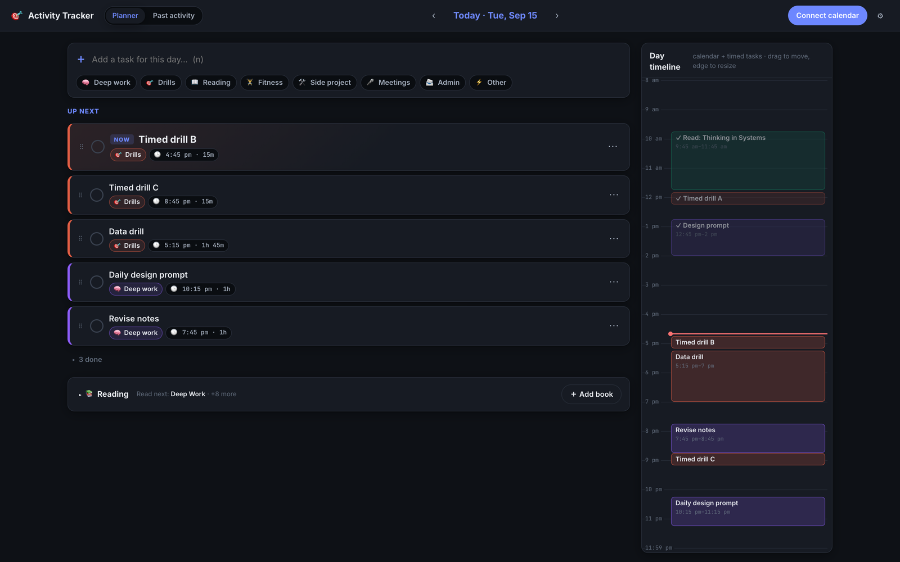
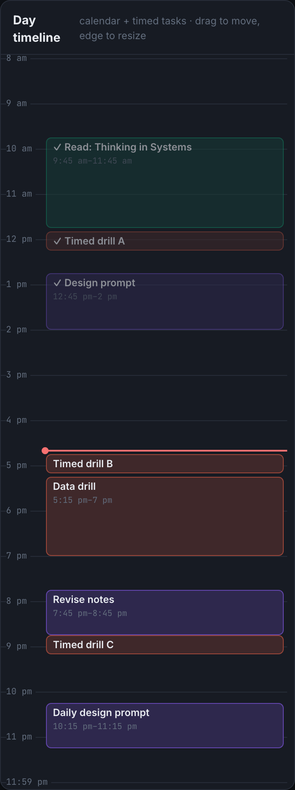
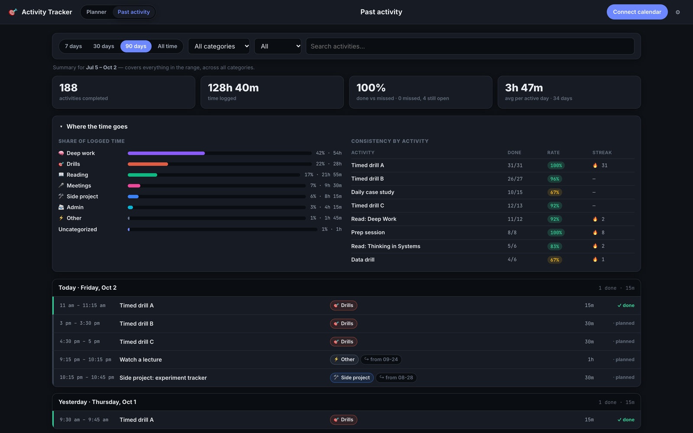
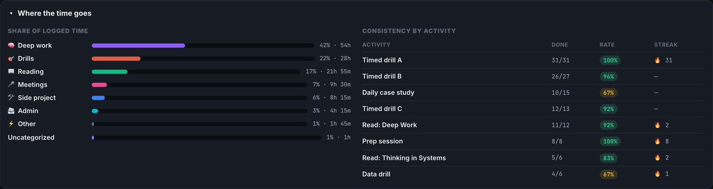

# 🎯 Activity Tracker

**A local-first day planner that tells you what to do next.** It gives you a
reorderable task queue for each day, recurring daily blocks, a tracker for
books you read in parallel, a timeline that schedules itself around your
calendar, and a history of what you actually got done.

It was built to keep a stretch of daily drills honest alongside an existing
routine, after hour-by-hour planning kept steering the day toward the easy
tasks. The categories are yours to rename: it works just as well for studying,
side projects, or any routine you want to stick to.

> **Your data never leaves your machine.** Everything lives in one SQLite
> file. There's no cloud backend, no account, and no telemetry.

---

## Contents

- [Features](#features)
- [Quick start](#quick-start)
- [How it works day to day](#how-it-works-day-to-day)
- [Past activity & insights](#past-activity--insights)
- [Calendar sync](#calendar-sync)
- [Architecture](#architecture)
- [Configuration](#configuration)
- [Testing](#testing)
- [Forking & customizing](#forking--customizing)
- [Privacy & security notes](#privacy--security-notes)
- [License](#license)

---

## Features

| | |
|---|---|
| **"NOW" card** | The first unfinished task is always front and center, so after a break you know what to do next right away. |
| **Drag-to-reorder queue** | Reorder your day in seconds with the mouse or keyboard (dnd-kit, fully accessible). |
| **Auto-scheduling** | Tasks without a time are packed into free slots between 8am and 10pm, around your calendar events. Reordering the queue re-sequences them. |
| **Calendar-style timeline** | Drag to move and drag the bottom edge to resize, like Google Calendar. Overlaps with real events are flagged automatically. |
| **Daily blocks** | Recurring routines appear on the weekdays you pick. Pausing a block stops it everywhere. |
| **Carry-over** | Unfinished tasks from earlier days show up in a banner, and one click brings them into today. |
| **Books shelf** | Track parallel reads by page, chapter, or percent. Pick what to read next and drop a reading task into today with one click. |
| **Past activity** | An append-only log of every completion, skip, and deletion, plus time-share and consistency/streak stats. |
| **Calendar sync** | Two-way Google Calendar (pull busy blocks, push tasks as events) or a zero-setup read-only ICS feed. |
| **Keyboard-first** | `n` quick add · `t` today · `←` / `→` previous / next day. |

---

## Screenshots

The planner: the first unfinished task is the **NOW** card, the rest of the
queue sits under it, and the timeline on the right is packed around your
calendar.



The timeline schedules untimed tasks into free slots; drag a block to pin it,
drag its edge to resize it. The red line is now.



Past activity: summary tiles over the append-only log, then where the time
went and how consistent each activity has been.





> These are a real five-week log with the activities renamed. The numbers are
> unchanged.

---

## Quick start

**Requirements:** Node.js 20+ (developed on Node 24) and npm.

```bash
git clone https://github.com/atmamoon/activity-tracker.git
cd activity-tracker
npm install
npm run dev
```

Open **http://localhost:5173**. The API runs on port `4820`, and the
database is created automatically at `data/tracker.db` on first launch, with
a starter set of categories (Deep work, Drills, Reading, Fitness, Side
project, Meetings, Admin, Other). Rename them to your own routine in
**Settings → Categories**.

### Production mode

```bash
npm run build   # bundle the React app into dist/
npm start       # Express serves the API and the built UI on http://localhost:4820
```

---

## How it works day to day

- **Quick add.** Type a title, tap a category chip, and press Enter. Press
  `n` from anywhere to focus the box.
- **Up next.** The top unfinished task becomes the big **NOW** card. Drag
  any card by its handle to reorder the rest of the day. For keyboard
  reordering, focus a handle, press space, then use the arrow keys.
- **Done / skip / move.** Check tasks off, skip them for today, or send them
  to tomorrow from the `⋯` menu.
- **Daily blocks** (Settings → Daily blocks). Your fixed routine is
  materialized into each day's queue on the weekdays you choose. Deleting a
  single instance won't make it come back that day.
- **Books.** Add the books you're reading, drag them into priority order
  (the top one gets a **READ NEXT** tag), and use **+ plan** to add a
  reading task to the current day. The shelf is collapsed by default and
  remembers your choice.
- **Timeline.** The right-hand panel shows calendar events (striped = busy)
  alongside your tasks. The red line marks the current time.
  - Tasks with no time are **auto-scheduled** into the next free slot.
  - **Dragging or resizing** a task pins its time, so auto-scheduling won't
    move it again. To hand it back, clear its time in the edit modal.
  - Any task that collides with a calendar event gets an **⚠ overlaps** badge.

---

## Past activity & insights

The **Past activity** tab is the permanent record of what you actually did.
Every completion, skip, reopen, and deletion is written to an append-only
`activity_log` table along with a snapshot of the task. History stays
accurate even after you rename a task, rename a category, or delete the task
entirely. Deleted items still appear, marked as removed.

- **The log.** Days are listed newest first. Each entry shows its time slot,
  duration, category, book, carry-over status, and outcome: *done*,
  *missed*, *skipped*, or *upcoming*. A past task that was never finished
  counts as **missed**, which shows you what's slipping.
- **Filters.** Filter by date range (7 / 30 / 90 days or all time),
  category, status, and title search.
- **Where the time goes.** See each category's share of logged time, plus a
  consistency table for every recurring activity: days done ÷ days planned,
  and your current streak.

> The summary tiles always cover the **whole date range**, not the filtered
> list. Completion rate is `done ÷ (done + missed)`. Today's open tasks
> aren't counted as failures, because the day isn't over yet.

---

## Calendar sync

Switch between the two modes in **Settings → Calendar**.

### Option A: Google Calendar (two-way)

Pulls your events in as busy blocks and pushes tasks out as events. You bring
your own OAuth client, so no third party ever sees your tokens.

1. In [Google Cloud Console → Credentials](https://console.cloud.google.com/apis/credentials),
   create an **OAuth client ID** of type *Web application*.
2. Add `http://localhost:4820/api/calendar/google/callback` as an authorized
   redirect URI.
3. Enable the [Google Calendar API](https://console.cloud.google.com/apis/library/calendar-json.googleapis.com)
   for the project.
4. Paste the client ID and secret into Settings and click **Connect Google account**.

Then choose which calendars count as busy time and which calendar tasks get
pushed to.

- **Push:** give a task a start time, then choose `⋯ → Push to calendar`.
  Later edits to its title, time, or date sync to the event automatically.
- **Pull:** sync runs when the app loads, every 10 minutes, and whenever you
  click the sync button in the header.

> While your OAuth app is in Google's *Testing* mode, add your own Google
> account as a test user on the consent screen.

### Option B: ICS feed (read-only, zero setup)

In Google Calendar, go to **Settings → *your calendar* → Integrate calendar**,
copy the **Secret address in iCal format**, and paste it into Settings.
Events are pulled in, recurring ones included. Pushing tasks isn't
available in this mode.

---

## Architecture

```
┌────────────────────────┐   JSON / fetch   ┌──────────────────────────┐
│  React 19 + Vite       │ ───────────────▶ │  Express 5 API (:4820)   │
│  zustand · dnd-kit     │ ◀─────────────── │  zod-validated routes    │
│  (:5173 in dev)        │                  │                          │
└────────────────────────┘                  │  better-sqlite3 ─▶ data/ │
                                            │  Google Calendar / ICS   │
                                            └──────────────────────────┘
```

```
├── server/
│   ├── index.ts            # entry point: opens the DB, starts Express
│   ├── app.ts              # app factory (used by the tests too)
│   ├── db.ts               # schema, migrations, default seed data
│   ├── routes/             # tasks, books, templates, categories, calendar, history
│   └── lib/
│       ├── schedule.ts     # auto-scheduling / free-slot packing
│       ├── materialize.ts  # daily blocks → concrete tasks per day
│       ├── activityLog.ts  # append-only history
│       ├── google.ts       # minimal OAuth + Calendar v3 client (no SDK)
│       ├── ics.ts          # ICS feed parsing incl. recurrence
│       └── sync.ts         # pull/push orchestration
├── shared/types.ts         # types shared by client and server
├── src/                    # React app (components/, state/store.ts, api.ts)
└── tests/                  # Vitest: API, scheduling, sync, UI
```

Design choices worth noting:

- **One process, one file.** SQLite in WAL mode is more than fast enough for
  a single user, and backing up means copying one file.
- **No Google SDK.** The OAuth and Calendar calls are a small `fetch`
  wrapper, which keeps dependencies light and makes the client easy to mock
  in tests.
- **Snapshots in the log.** History rows copy the task's title and category
  at the time of the event, so analytics never break when the source data
  changes.

---

## Configuration

| Variable   | Default            | Purpose                               |
|------------|--------------------|---------------------------------------|
| `API_PORT` | `4820`             | Port for the Express API              |
| `DB_PATH`  | `data/tracker.db`  | Location of the SQLite database       |
| `NODE_ENV` | —                  | Set to `production` to serve `dist/`  |

If you change `API_PORT`, update the Google OAuth redirect URI to match.

---

## Testing

```bash
npm test            # 96 tests: API, scheduling, history/stats, Google sync (mocked), ICS, UI
npm run test:watch
npm run typecheck   # client + server TypeScript projects
```

Every test runs against an in-memory SQLite database, and Google is replaced
by a fake token and calendar backend, so no network access or credentials
are needed.

---

## Forking & customizing

This is meant to be forked and adapted to your own routine.

- **Categories.** Rename, recolor, or archive them in Settings. To change
  what a fresh database starts with, edit `DEFAULT_CATEGORIES` in
  [`server/db.ts`](server/db.ts).
- **Scheduling window.** The 8am to 10pm packing window and slot logic live
  in [`server/lib/schedule.ts`](server/lib/schedule.ts).
- **Look & feel.** All styling is in a single file,
  [`src/styles.css`](src/styles.css).
- **Starting fresh.** Stop the app and delete the `data/` folder. A new
  database is created on the next launch.
- **Backups.** Copy `data/tracker.db` along with its `-wal` and `-shm` files,
  or stop the app first and copy just the `.db`.

Pull requests and issues are welcome.

---

## Privacy & security notes

- `data/` is gitignored. Your tasks, activity history, and Google OAuth
  credentials and tokens are stored only in the local database, so they
  won't end up in a commit.
- The app is designed for **single-user, local use** and has no
  authentication. Don't expose port `4820` to the internet or to an
  untrusted network.

---

## License

[MIT](LICENSE) © Mamoon Mondal
